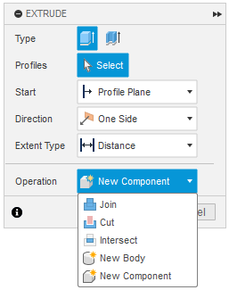

# Design Hierarchy

## Understanding Design Hierarchy in Fusion 360
When working in Fusion 360, it’s essential to keep your design organized by separating different parts into individual components. This helps maintain an organized design, simplifies joints, and avoids errors in assemblies later on.

## Why Keep Parts Separate?
While it might seem easier at first to model everything as a single body or component, this can quickly lead to a buggy mess. Using components to represent each part of your design ensures that:

* Each part is seperate and can be edited independently
* You can simulate movement between parts
* You avoid accidentally merging or altering unrelated bodys
* It’s easier to export or 3D print individual parts later

## Design Hierarchy Overview
Fusion 360 uses a hierarchical structure to organize your design:

1. Top-Level Component
    * This is your main assembly or overall design
    * In your browser (the left-hand panel), this is  named after your file and its version number (e.g., “Fractal Vice v14”)
    * It holds every part of your design including global sketches, construction planes, and joints
2. Subcomponents
    * These can be either individual parts, or groups of even more subcomponents
    * Each subcomponent contains its own:
        * Sketches
        * Bodies
        * Construction geometry
        * Optionally, more nested subcomponents
3. Bodies and Sketches
    * Each component contains its own bodies and sketches
    * avoid mixing sketches or bodies from different components unless intentionally shared
    !!! tip
        When you activate a component, any sketches you create will be contained within that component. To keep your design organized, make sure not to create sketches while the top-level component is active, unless the sketch is intentionally meant to be global

## Common Beginner Mistake: Using Bodies Instead of Components
When you're just getting started, it's tempting to treat each body as its own part. For simple models, this might seem fine, but as your design grows, this approach becomes messy and brings many issues
Instead, create a new component for each distinct part:

* Any parts that are meant to be separate should be created as their own components, even if they will eventually be screwed, glued, or otherwise attached together
* Any screws, sliders, or pins should also be separate components
* For more complex designs, such as a robot, each assembly should also be created as a component, with subcomponents for each individual part (e.g., linear slide, intake, drivetrain, etc.)

## Tips for Working with Components
* Always activate the component you’re working on (right-click → “Activate”) so that all sketches and features are nested correctly
* Use "New Component" instead of "New Body" when starting a separate part
* Components make it easy to export individual parts for 3D printing, CNC machining, or importing into other designs
* You can easily drag and drop sketches, bodies, or even entire components within the browser to change where they appear in the hierarchy. This is useful for reorganizing parts or correcting misplaced items

!!! tip
    In Fusion 360, many tools allow you to change the operation type, this means you can change from Join or New Body to New Component, which creates a new component within the currently active one 
    

