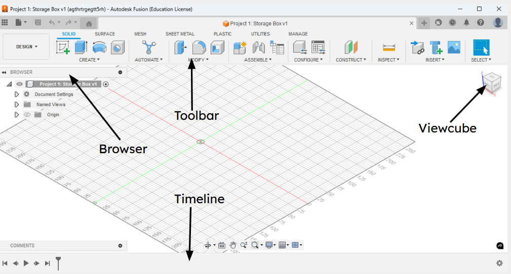

# Fusion 360 Layout

Understanding the layout of Fusion 360 will help you work more efficiently, so explore the different tabs and memorize some key terms. Fusion 360’s interface is divided into several areas to help you design, model, and simulate parts effectively, and don’t worry, if you make a mistake or misclick, you can always press CTRL + Z to undo it.

## Toolbar (Top)
* Contains workspaces like: 
    * Solid
    * Surface
    * Mesh
    * And many more
* The tools available change depending on the active workspace
## Browser (Left Panel)
  * A tree view of all components, bodies, sketches, and any other elements
  * Helps you organize and manage your designs hierarchy 
## Canvas (Center)
  * The main 3D workspace where you build and view your model
  * This is where you interact with sketches, bodies, and any other elements
## ViewCube (Top-Right)
  * The ViewCube lets you click or drag to change your 3D view (e.g., Front, Top, Isometric)
  * The ViewCube also has tools for topdown and side viewing, zoom, and home view reset
## Timeline (Bottom)
  * Shows a history of all actions (sketches, extrudes, fillets, etc.)
  * You can reorder, edit, or suppress features here