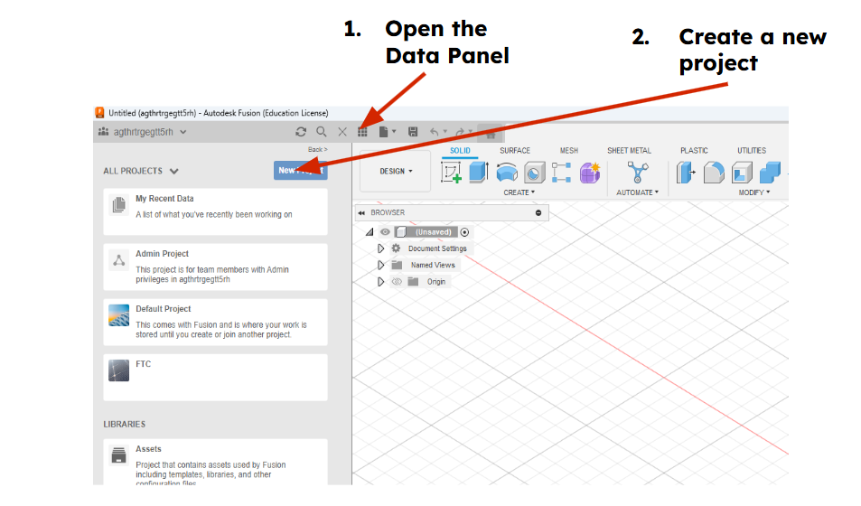

# Project Management

## Fusion 360:
Fusion allows you to organize your files simler to most standard file systems. When creating your first design, make sure to create a new project for it. With more complex projects, you might value having folders inside your project to aid with organizing, but at the start, keeping all your practice designs in one project is enough

