# Project 1: The Box

For this first project, you'll design a simple storage box with a lid and side holes. It introduces key Fusion skills like creating components, sketching and constraining geometry, using tools like Extrude and Shell, and organizing your design for future projects.

## Creating the Design
* Every time you open Fusion, it makes a new untitled design
    * First step is to press `CTRL + S` to name and save your new design
    * Name it “Project 1: Storage Box”
    * Make sure it's in the project folder you made earlier, then hit save
    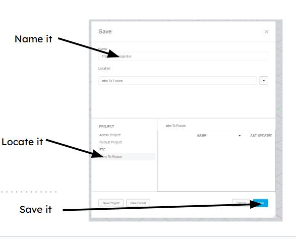
* Before making a sketch, plan out what you want to make
    * For this first project, you are going to design a simple box and lid with some holes 
    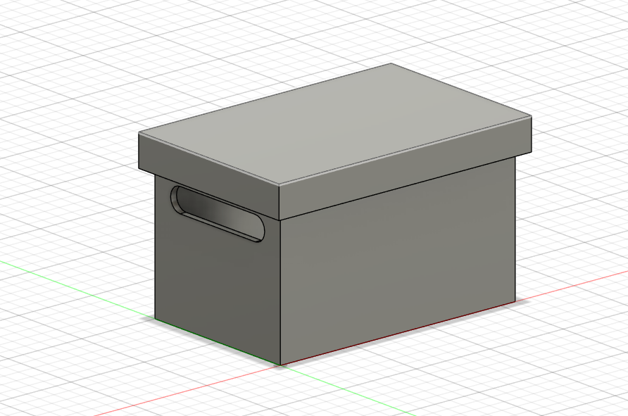

## Creating Bodies
* Create a component for your box
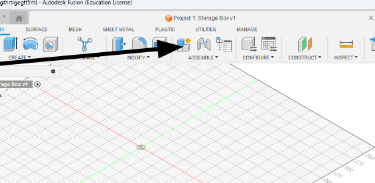
* Name your new component before clicking OK
* The component will now appear in your browser, make sure the circle next to it is ticked
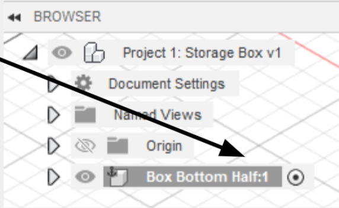
* Now that you have your new component, click Create Sketch
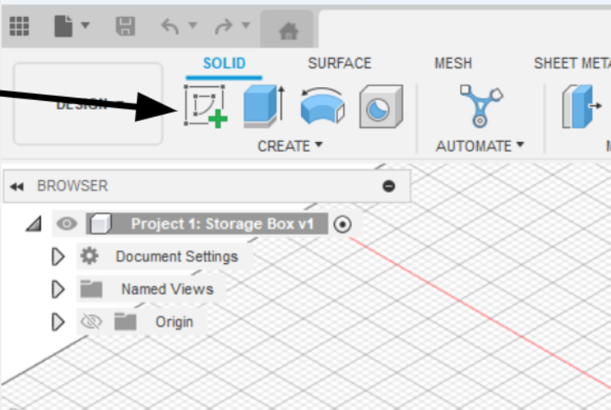
* Make this sketch on the X/Y plane
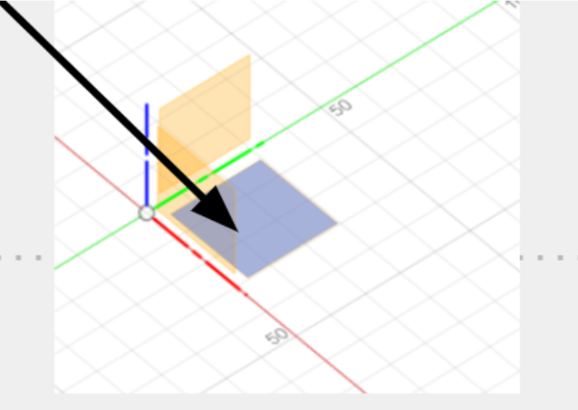
* In sketch mode, you will see a new tab appear on your toolbar; this sketch tab will have all the tools you need to create a sketch.
* Press `R` or click the rectangle tool in your toolbar to create a rectangle
* Click the origin point (where the X and Y axes cross) 
* Click a random point for the second point of the rectangle
* Now you can click `TAB` to switch between the height and width, make it something like 30mm by 50mm 
* Once you're done, you can check to make sure your sketch is constrained by clicking the arrow next to your component in the browser, then clicking the arrow next to the sketch folder. If there's a  pencil, it's not fully constrained, If there's a red lock, it is
    * Note on constraining sketches: if your sketch has any blue lines and/or has a pencil next to the sketch, it's not constrained, which means the program doesn't know the value of every angle and shape
    * This is bad because it means you don’t know the exact size of your design. For example, if your box’s width wasn’t defined, it could be 50mm or 500mm, but you don’t know
    * Learning how to constrain sketches is an important skill, but for now, all you need to know is three things a sketch needs:
        * An origin point, so it knows where it should start
        * Lengths of every line defined (Ex, is your box 10mm tall or 50mm?)
        * Angles (Ex: are the lines of a rectangular box 90° to each other? Is your whole box rotated 30°?)
* Once you're done with the rectangle, the area inside of it should be highlighted blue. Click on this area, then click `E` to extrude
* You should see a menu pop up and an arrow on top of the area, pull up the arrow until you like the height of your box, or if you want, you can manually type in a height, 40mm should be good
* If everything worked, you should have a simple box now

## Modifying Bodies
* The modification tab has all sorts of useful tools, and most of them can be learned with a quick Google search, so I encourage you to play around with it
* For now, you will use the Shell modifier to make your box hollow
* Select the shell tool, then select the faces you want to keep open and the thickness of the shell (you will be selecting the top face)
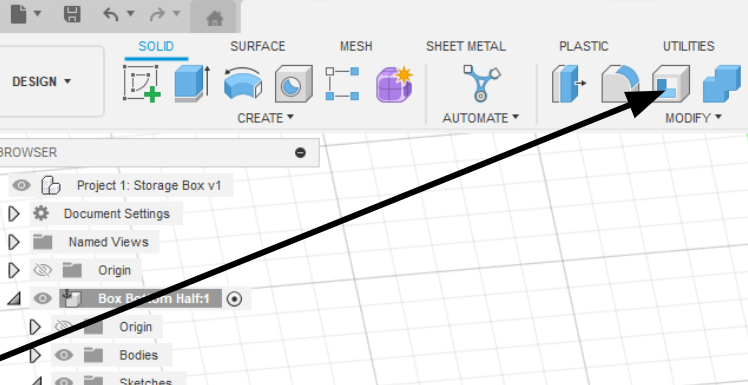
* Do a thickness that looks good, I would do ~2mm 
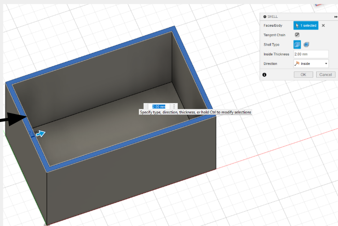
* Take a moment to save your work
    * Saving your design frequently is important
    * to do so, just click `CTRL + S` and just leave it as “User Saved” then hit OK
    * It's easy to forget to save a design, so as a beginner, setting a 5-minute timer is useful
* Now time to make the holes
    * Sketches can be made on more than just the origin plane; any flat plane can be used to create a sketch
    * For the next step, you will be making holes in our box
    * To do this, you will create a sketch on the side of the box
    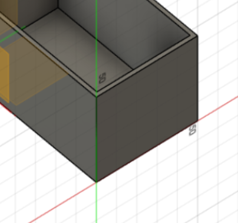
* Fusion uses diameter instead of radius, so you must keep that in mind when making circles
* To make the holes, create a circle and give it a diameter. **Make sure not to create it with an origin; the outline of it should be blue**
* You can use copy and paste in sketch mode, so copy and paste the circle you made
* Next, you will create two lines between the circles and use Tangent and Horizontal/Vertical constraints on them
    * When you create a sketch on an existing plane, it automatically projects whatever is on that plane into your sketch, which is quite useful for constraining sketches
    * You will use this by making each circle's center point a few millimeters away from the top and side edge of the box
* Make sure everything is constrained by looking for a red lock in the browser next to your sketch
* Finish the sketch by clicking the green check in the toolbar
* Click on each face you want to cut while holding `Shift`, then press `E` to extrude
    * Using a negative value or pulling the arrow in the direction of the cut automatically switches the extrude from creating more material to cutting away from your design
    * Make sure the cut goes all the way through the wall before clicking `Enter`
    * (You could pull it through the other wall to cut both holes at the same time, but I want a chance to teach other tools so just go with me for this one)
    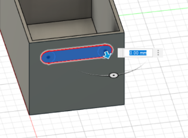

## Construction Elements
* Construction planes are like a temporary frame to build on top of
    * You can use them to create sketches at weird angles, create lines to rotate a component along, or create points to make holes through
* You will be using a midplane to mirror your hole on the other side of your box
    * To do this, go under Construct and click on mid plane
    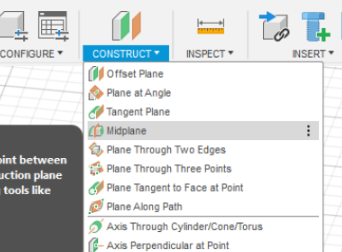
    * Select the outside plane of each side of the box and hit `Enter`, making sure a yellow plane appears in the center of the box
    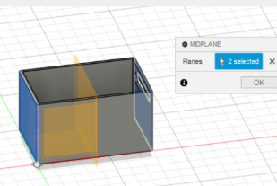
* Save again so you don't lose any work!
* Using patterns to repeat an action can be a big time saver
    * In this case, you will be using the mirror action to mirror the hole you made
    * To do this, select the Mirror option under Create
    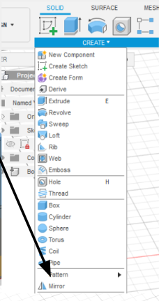
    * Change object type to Features
    * For Objects, select the hole we made
    * For the Mirror plane, select the Construction plane you made
    * Make sure a hole appears on the other side, then hit `Enter`
    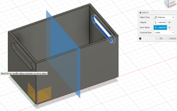

## More Components
* Now that you are done with the bottom of your box, you need to make a lid
    * To do this, create a new component and name it Lid
    * When you click OK, the bottom box should turn transparent
* To create the lid, you will create a sketch on the lip of the box
    * To do this, right-click on the lip of the box and click Create Sketch
    .png)
    * While in sketch mode, use the offset tool in the modify part of the toolbar to offset the edge of the top; this will be the gap between the box and lid
        * Repeat the last step, but make a larger offset (3-4x the last one)
        * Make sure this new sketch is defined, then select the area between the two offsets and press `E`
        * When in extrude mode, change Direction to Symmetric, then extrude the lid
        .png)
* When you have more than one component in Fusion, you are able to freely move them around the 3D space
    * This can often be annoying when you are trying to work on a part
    * You can stop this movement by pinning the component in place
* To do this, right-click on the component and click Pin
    .png)
    * If you accidentally moved the component before doing this, you can click revert position in the toolbar to move it back
    .png)

## Finishing Touches
* To finish the lid, you need to add a top
    * To do this, all you need to do is create a sketch on top of the lid
    * Before you extrude, you need to know how thick it should be
    * To check this, you need to click Measure in the Inspect part of your toolbar 
    .png)
    * Then you select the inner and outer lines of any side of your lid
    .png)
    * The distance will be displayed on screen and in the settings of the Measure tool
* Once you have this thickness, simply click the inner and outer area of the sketch and press `E`, then extrude up the same distance as your thickness
    .png)
* Save your design!
* The last step is to activate the whole design
    .png)
    * After this, you are done!

