# Project 2: Robot Arm

For this project, you'll design a robotic arm with articulated claws. It introduces more advanced Fusion 360 skills like creating circular patterns, mirroring complex bodies in 3D, working with angled construction planes, and assembling parts using joints. You'll also learn how to organize complex mechanical designs for movement and future iteration.

## Creating the Design
* First, you create a new component for the base
    * Then, create a sketch with a circle and extrude it

    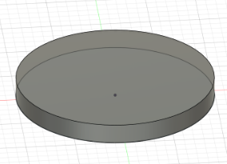

* Next, you make another sketch on the XZ plane
    * You can use Project `P` to project any selectable object onto your sketch
    * In this case, you want to project the side profile of your disk, then create a 45° Triangle along one edge. You can edit the angle between two lines by pressing `D`, and then clicking on both lines

    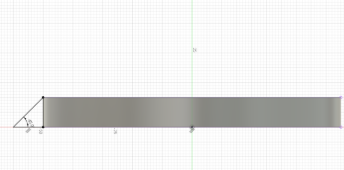

* The Revolve tool can spin any 2D face around an axis
    * In this design, you will revolve the triangle you made to make sure it follows the edge of your disc
    * To do this, you will select the Revolve tool from the Create section of the toolbar
    * Then choose the triangle you made and the origin Z-axis for your axis
    * Revolve 10° then hit OK

    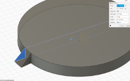    

* Using Patterns to repeat a design can save lots of time
    * In this case, you will use the circular pattern tool found under Patterns in the Create section of the toolbar
    * Set Object Type to Features, select the triangular prism you made, and set Axis to be the origin Z axis
    * The amount you want is 18 since each triangle is 10°, and if we want even spacing between each triangle, that's  360° / amount of triangles * 2 (for the space between each triangle) = 10°, so the number of triangles is 18
    
    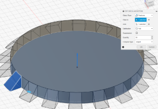  

## Finishing The Base
* To finish the base, make a sketch on top of your disk and make a smaller circle, then extrude it to the same thickness as the first disk

    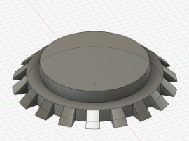  

* Next, you will make another sketch atop this new disk and make a Rectangle `R`, then use the equal constraint to make two adjacent sides equal
    * Set the length of one side using Dimension `D` to be a little smaller than the disk
    * Divide this side length by two and define 2 sides to be that distance away from the origin to center your square
    * Next, you will make two horizontal lines about ⅕ of your total length away from the two edges of your square

    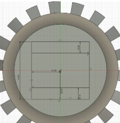  

    * Select the two smaller rectangles made by your sketch and extrude them

    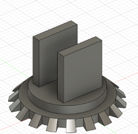  

* Finally, use the Fillet tool in the Modify section of the Toolbar to polish the edges of the rectangles you extruded

    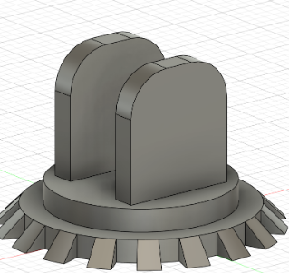  

* Then create a sketch on one of the extrusions
    * Under the Sketch Palette, switch the line type to Construction

    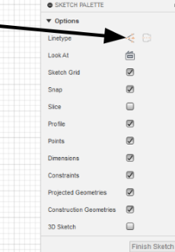   

    * Construction Lines are just like Construction Planes; they act like normal lines but are just used as a reference for other things
    * Create a line `L`  down the middle of your sketch, making sure the little midline (triangle) symbol appears at both ends of your Construction Line
    * Turn off the Construction Line type, then make a circle `C` at any point on your Construction Line

    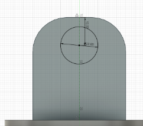   

    * Use Dimension `D` to make your circle a little way down from the edge, then extrude the circle to cut both extrusions

    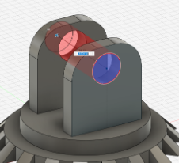  

## Mid Arm
* Activate your whole design, then create a new Component called Mid Arm
* Create a sketch on the inside face of one of the two extrusions
    * To create the sketch, simply make a rectangle `R`, then add a construction line to act as your mirror line
    * Project `P` the hole in the extrusion onto the sketch
    * Define the two edges of the rectangle to be collinear with the edges of the extrusion using the Collinear Constraint, and make the bottom edge of the rectangle around the middle of the extrusion
    * Add some fillets to the edge, then mirror the bottom section onto the other end

    .png)  

    * Finally, extrude the Mid arm

    .png)  

## Claw Frame

* Activate your whole design, then create a new Component called Claw Frame
* Create a midplane between the ends of the Mid Arm

    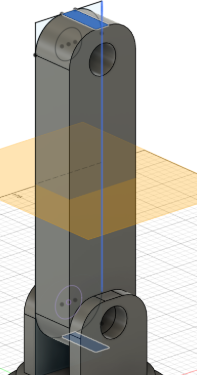  

* Mirror the extrusions, making sure to also include the fillets and holes

    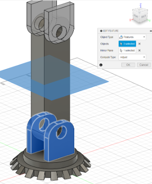  

* Right-click on the top face of one of your new extrusions, then project `P` to create a circle the same size as the one below

    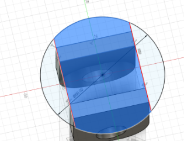  

    * Create two vertical lines and make them Collinear to each edge of the extrusions, then extrude the mid-section of this sketch

    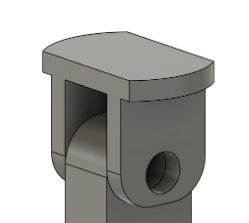  

* Create another sketch on the top face. Create two lines about ⅕ from each edge, then extrude these outside rectangles

    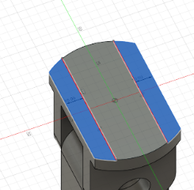  