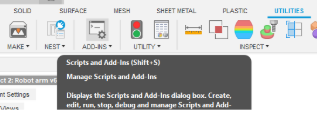
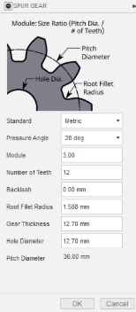
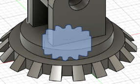
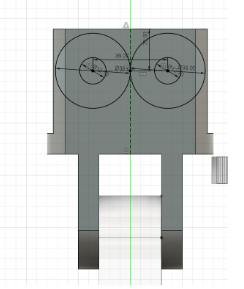

# Project 2: Robot Arm

For this project, you'll design a robotic arm with articulated claws. It introduces more advanced Fusion 360 skills like creating circular patterns, mirroring complex bodies in 3D, working with angled construction planes, and assembling parts using joints. You'll also learn how to organize complex mechanical designs for movement and future iteration.

## Creating the Design
* First, you create a new component for the base
    * Then, create a sketch with a circle and extrude it

    

* Next, you make another sketch on the XZ plane
    * You can use Project `P` to project any selectable object onto your sketch
    * In this case, you want to project the side profile of your disk, then create a 45° Triangle along one edge. You can edit the angle between two lines by pressing `D`, and then clicking on both lines

    

* The Revolve tool can spin any 2D face around an axis
    * In this design, you will revolve the triangle you made to make sure it follows the edge of your disc
    * To do this, you will select the Revolve tool from the Create section of the toolbar
    * Then choose the triangle you made and the origin Z-axis for your axis
    * Revolve 10° then hit OK

        

* Using Patterns to repeat a design can save lots of time
    * In this case, you will use the circular pattern tool found under Patterns in the Create section of the toolbar
    * Set Object Type to Features, select the triangular prism you made, and set Axis to be the origin Z axis
    * The amount you want is 18 since each triangle is 10°, and if we want even spacing between each triangle, that's  360° / amount of triangles * 2 (for the space between each triangle) = 10°, so the number of triangles is 18
    
      

## Finishing The Base
* To finish the base, make a sketch on top of your disk and make a smaller circle, then extrude it to the same thickness as the first disk

      

* Next, you will make another sketch atop this new disk and make a Rectangle `R`, then use the equal constraint to make two adjacent sides equal
    * Set the length of one side using Dimension `D` to be a little smaller than the disk
    * Divide this side length by two and define 2 sides to be that distance away from the origin to center your square
    * Next, you will make two horizontal lines about ⅕ of your total length away from the two edges of your square

      

    * Select the two smaller rectangles made by your sketch and extrude them

      

* Finally, use the Fillet tool in the Modify section of the Toolbar to polish the edges of the rectangles you extruded

      

* Then create a sketch on one of the extrusions
    * Under the Sketch Palette, switch the line type to Construction

       

    * Construction Lines are just like Construction Planes; they act like normal lines but are just used as a reference for other things
    * Create a line `L`  down the middle of your sketch, making sure the little midline (triangle) symbol appears at both ends of your Construction Line
    * Turn off the Construction Line type, then make a circle `C` at any point on your Construction Line

       

    * Use Dimension `D` to make your circle a little way down from the edge, then extrude the circle to cut both extrusions

      

## Mid Arm
* Activate your whole design, then create a new Component called Mid Arm
* Create a sketch on the inside face of one of the two extrusions
    * To create the sketch, simply make a rectangle `R`, then add a construction line to act as your mirror line
    * Project `P` the hole in the extrusion onto the sketch
    * Define the two edges of the rectangle to be collinear with the edges of the extrusion using the Collinear Constraint, and make the bottom edge of the rectangle around the middle of the extrusion
    * Add some fillets to the edge, then mirror the bottom section onto the other end

    .png)  

    * Finally, extrude the Mid arm

    .png)  

## Claw Frame

* Activate your whole design, then create a new Component called Claw Frame
* Create a midplane between the ends of the Mid Arm

      

* Mirror the extrusions, making sure to also include the fillets and holes

      

* Right-click on the top face of one of your new extrusions, then project `P` to create a circle the same size as the one below

      

    * Create two vertical lines and make them Collinear to each edge of the extrusions, then extrude the mid-section of this sketch

      

* Create another sketch on the top face. Create two lines about ⅕ from each edge, then extrude these outside rectangles

      

## Gears
* Custom scripts are a fun, advanced Fusion 360 tool, but Fusion has many built-in scripts
!!! info
    Fusion 360 supports custom scripting in both Python and C++, so if you're familiar with either language, it's a great opportunity to explore automation in your designs

* The one you are using today is SpurGear
* First, make sure to activate the whole design
* To access the SpurGear script, click on Utilities at the top of the Toolbar, then click Addons, scroll down until you see SpurGear, and click either the Python or C++ version (they’re the exact same), then hit Run

     

    * Copy my settings, then hit OK

     

    * You should see a gear spawn at the origin of your design

     

* To figure out the Positioning of your gears, you should make a sketch of where they go
    * To do this, just make a sketch on the side of the Claw Frame,
    * Then make two circles at the same center point, make one the hole diameter of the gear (12.7mm) and one the pitch diameter (36mm)
    * Copy and paste the circles and move the two new ones a little
    * Make a construction line that is 36mm between the centers of  the pairs of circles
    * Create another construction line going down the middle of the Claw frame
    * Use the point tool in your Toolbar under Create and place it in the midline of your first construction line
    * Set your point to the middle of the second construction line using the Midpoint constraint
    * Finally, use the dimension tool `D` to make the circles a little above the middle of the Claw Frame 

     

## Joints/Motion Links
* Using joins in fusion allows you to see the movement of your design without having to manufacture it
!!! tip
    It's good practice to stimulate your design with joints before actually testing it in real life
* Joints always have to be between two separate components
* To create the movement of your arm, you first need to create pins to hold the gears in place
    * To do this, extrude the smaller circles you made in your sketches from earlier 

    .png) 

    * Create a new component called Large Pin
    * Starting at the point between your Base and Mid Arm, create a sketch on the side of the base and make a circle ~0.5mm offset from the hole

    .png)

    * Extrude this sketch until it's flush on the other side of the base
* Click Joint in the Assembly part of your Toolbar
* There are many different types of movements for Joints. For now, you will use the Revolute Joint, which can be accessed in the little selector on the screen or in the Motion section of the Edit Joint popup
    * Component 1 is always the component that is moving, so the Large Pin will be your Component 1
    * To select the pin, go to either end of it and hover over the face while holding `CTRL`, then select the center point
    * Do the same to either face of the Base and select the center point of the hole
    * Then slide the pin using the arrows back to the position it was in before

    .png)

* Now, to rotate the Mid Arm, we use the same steps as before, but with the Rigid Joint and the Mid arm as Component 1 and the pin as Component 2

    .png)

* To make sure it worked, unpin the Mid arm by right-clicking on it and clicking unpin, then just move it around a little to make sure it rotates around the base
* Revert position and repin the Mid arm 
* Activate the whole design, then copy and paste the Large pin
* Repeat the steps from before, but make the Rigid joint from the Pin to Mid arm and the Claw Frame revolve around the pin

    .png)

* When you create the Revolute Joint, you may have noticed it flips the whole Claw Frame. To fix this, just double-click on the Revolute Joint and change it to 180°, then hit Capture Position in the Toolbar, then pin the Claw Frame

    .png)

* Now, create a new component called Small Pin and repeat the steps for the large pin, but for the holes you made in the Claw Frame

    .png)

* Create a Revolute Joint for the small pin, then copy it and make another Revolute Joint, but before hitting OK, change the angle offset to 15° under Alignment to make sure the gear teeth mesh properly

    .png)

    .png)

* Copy and paste the gear and create a Rigid Joint for each gear and pin

    .png)

* Spin the gears around a little to make sure everything works, then hit Revert Position
* Motion Links let you define movement between two different links
!!! tip
    Motion links let you define movement between different types of joints. For example, you could create a rack and pinion mechanism and set the rack to move 10 mm for every full rotation of the pinion.
* In this case, we want our two gear's revolve links to spin in opposite directions
* To do this, just select Motion Link under Assemble
    * Select the two Revolute Joints, then in the popup menu, change one angle to 360° and one to -360°, which means that for every full rotation one joint makes, the other does a full rotation in the other direction

    .png)

    * Click the play button to confirm it looks right, then hit OK

## The Claws
* Now that you have a gear, you want to turn it into an actual claw
    * To do this first, pin one of the gears so they don’t move
    * Then you need to create a plane to create your claw around
    * In this case, you're going to use the edge of a tooth from the gear as your starting plane
* Due to some weird bugginess with the SpurGear script, the ends of the gear teeth aren't flat, so you need to create a construction plane
    * To do this, use the Plane Through Two Edges in the Construction section of the Toolbar and use the two edges of the gear tooth

    .png)

    * Create a sketch and Project `P` the edge of the tooth, then add a rectangle the same width and 3x as tall as the edge of the tooth

    .png)

    * Center it with the center of the gear tooth 
    * Extrude your sketch downward until it's fully joined with the gear, then change the operation from Cut to Join

    .png)

    * Because of the bugged face again, to extrude the arm up, you first have to extrude the two outer rectangles

    .png)

    * Then select the inner face of one of these extrusions and extrude it to join the other extrusion (make sure to change the operation from Cut to Join)

    .png)

    * Now, make a sketch on the side of this extrusion
    * Project `P` the front face of the Claw Frame and the extrusion then create a construction line perpendicular and at the midpoint of the Claw Frame, and make it as long as you want your claw to be
    * Create a line from the tip of the constitution line to the tip of the extrusion from earlier
    * Create another line from any point on the construction line to any point on the left edge of your extrusion, and make it parallel to the other line
    * Make them the same width apart as the width of your extrusion
    * Add a Fillet to the sharp corner of the extrusion, then make a vertical line in between the two angled lines you made, and make it a few millimeters away from the center construction line
    * Mirror everything you made on the other side

    .png)

* First, extrude the Fillet you made to round the corners a little

    .png)

* This might cause the sketch to hide, so unhide it in the browser
* Then, extrude the left half of your sketch, set the Extent type to To Object, and select the back face of your gear as the object

    .png)

* Repeat the last step for the other half of the sketch

    .png)

* Unpin the gears and spin them a little to make sure the claws are properly joined to the gears, then go component by component, making sure all the rotation works properly
* Save!
* Activate the whole design, and you should have something like the arm below

    .png)